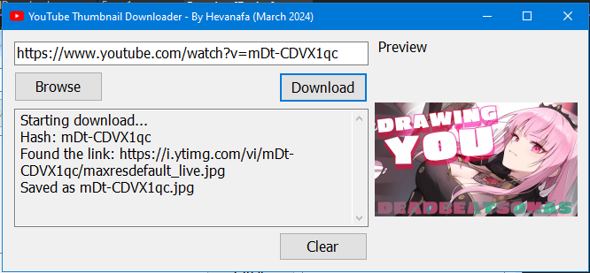

# YouTube Thumbnail Downloader

<!--  -->

*(YouTube icon from FreePik)*

This tool helps with downloading YouTube thumbnails.

Update with the dark theme:

This works with both normal YouTube links and shorts.

## How to Use

How to use this tool is pretty straightforward.

Copy & paste a YouTube link into the textbox on the top left, then press the **Download** button.

This tool will attempt to download the thumbnail and saves it into the `thumbs` folder.

After that, press Browse to see the collection with the File Explorer.
